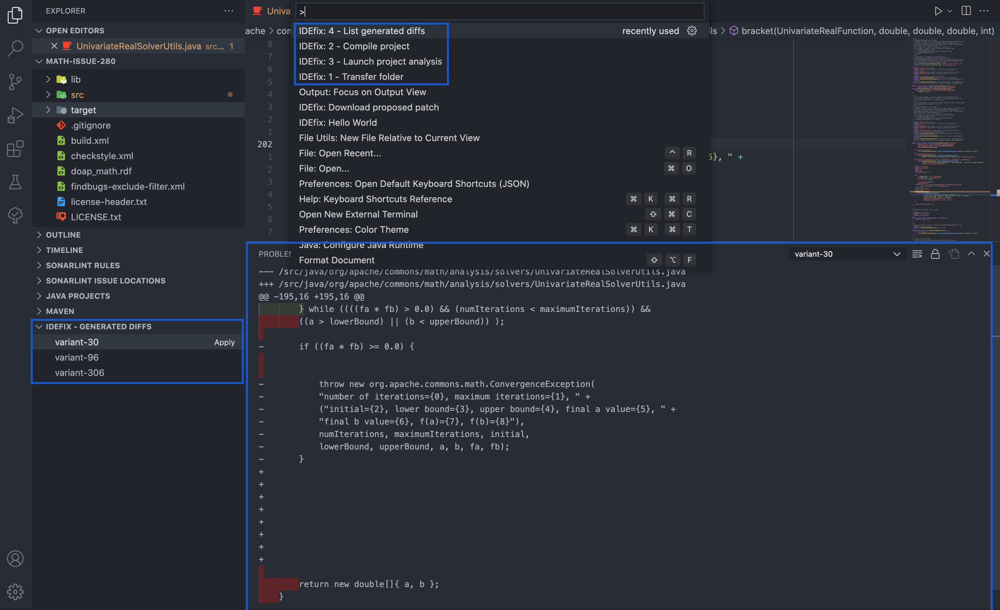

# IDEfix - Visual Studio Code extension

## Presentation
IDEfix is the integration of an [APR](https://program-repair.org/) tool ([Astor](https://github.com/SpoonLabs/astor)) into an IDE (Visual Studio Code).
It offers fixes for Java programs.

## Prerequisites

- Visual Studio Code
- [The back-end of the extension](https://github.com/RomainVacheret/idefix)

## Installation

- Open the project in VSCode
- Launch the debug mode (`F5`)

It will open a new VSC window which will have the extension set up

## Example

- Copy the [Math-issue-280](https://github.com/SpoonLabs/astor/tree/release/examples/Math-issue-280) folder from the `example` folder of Astor (it should have been installed when you set up the [server](https://github.com/RomainVacheret/idefix))
- Open it in the VSC instance with the extension installed
- Launch the commands in this order:
  - `IDEfix: 1 - Transfer folder`
  - `IDEfix: 2 - Compile project`
  - `IDEfix: 3 - Launch project analysis`
  - `IDEfix: 4 - List generated diffs`
- In the explorer tab, you will have a menu `Idefix - generated diffs`, click on it
- If the diffs are not displayed, click on the `Refresh` button
- Click on a diff to have it displayed in the `Output` view (in the same menu as the terminal)
- Choose which diff to apply and click on the  `Apply` button (back in the explorer view)
- The diff will be applied to the project

## IDEfix overview in VSC

*Notes:*
- *To execute a command, open the Command Palette either by clicking on the gearwheel in the bottom left corner of the window or by using the `Ctrl/Cmd-Shift-P` shortcut and type its title*
- *The commands may take some time to run, be sure the previous one is complete successfully before starting the next one* 